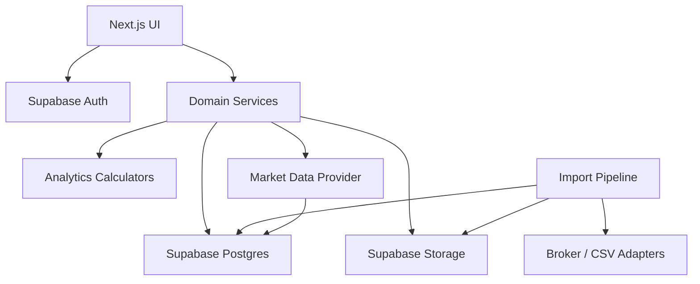

# Architecture

# Context

Investment Analyzer is a transaction-led portfolio analytics platform. The system treats buy, sell, dividend, fee, and tax transactions as the source of truth, then derives holdings, portfolio value, gains, dividend income, and decision-level metrics from those records.

The architecture should optimize for:

- reproducible analytics
- auditability back to imported source data
- calculated holdings rather than stored holdings
- future broker independence
- a clear separation between ingestion, domain logic, analytics, and presentation

# System Overview

The initial product can be delivered as a Next.js application backed by Supabase.

Core components:

- Next.js frontend for authenticated user workflows and analytics views
- Supabase Auth for registration, login, session handling, and user identity
- Supabase Postgres for transaction, price, import, and source-document data
- Supabase Storage for imported broker files, CSV uploads, and postbox documents
- Domain service layer for portfolio, transaction, dividend, performance, import, and market data logic
- Broker adapter layer for Comdirect first, with additional brokers added through the same ingestion contracts

# Logical Architecture

# Application Layers

## Presentation Layer

Responsible for rendering user workflows and analytics.

Primary screens:

- authentication
- dashboard
- portfolio development
- securities list
- transaction list
- lot-level purchase analytics
- dividend analytics
- securities discovered from transaction history
- import history and source traceability

The UI should request derived values from domain services rather than implementing calculations directly in components.

## Domain Service Layer

The domain layer is the center of application behavior. It should expose use-case-oriented services such as:

- `portfolioService`
- `transactionService`
- `dividendService`
- `performanceService`
- `importService`
- `marketDataService`

Responsibilities:

- validate user-owned data access
- normalize transaction inputs
- capture security identity from transactions
- derive holdings from transactions
- calculate realized and unrealized gains
- calculate dividend analytics
- calculate portfolio development over time
- connect metrics back to source transactions
- provide stable contracts to the UI

## Analytics Layer

Analytics should be deterministic functions over transaction, price, and dividend data.

Important calculators:

- current holdings by security
- lot inventory and remaining quantity
- invested capital over time
- portfolio value over time
- realized and unrealized gain
- total dividends received
- dividend income by security and lot
- annualized return by purchase lot
- yield on cost by purchase lot

Analytics should return trace metadata whenever possible so the user can understand which transactions contributed to a metric.

## Data Access Layer

The data access layer should isolate Supabase queries from business logic.

Responsibilities:

- typed database reads and writes
- row-level-security-aware queries
- transactional import writes where possible
- idempotency checks for imports
- reusable query functions for transactions, prices, securities, and source documents

## Ingestion Layer

The ingestion layer should normalize all external inputs into a shared canonical model.

Initial sources:

- manual entry
- CSV import
- Comdirect import

Future sources:

- Comdirect API synchronization
- Comdirect postbox parsing
- Trade Republic
- Interactive Brokers

Each source should implement the same import stages:

1. Capture source file or external payload.
2. Parse broker-specific data.
3. Normalize rows into canonical transaction candidates.
4. Validate securities, quantities, currencies, fees, and taxes.
5. Detect duplicates.
6. Persist accepted records.
7. Store import run status and source traceability.

# Broker Adapter Boundary

Broker-specific logic should stay behind adapter interfaces. The rest of the application should not need to know whether a transaction came from Comdirect, CSV, manual entry, or another broker.

Adapter responsibilities:

- parse external fields
- map broker transaction types to canonical transaction types
- normalize dates, currencies, quantities, fees, and taxes
- preserve external identifiers
- attach source document references

Canonical transaction types:

- `buy`
- `sell`
- `dividend`
- `fee`
- `tax`

# Portfolio Calculation Strategy

Holdings must be calculated from transactions, not stored as master data.

For each security identity:

1. Sort buy and sell transactions by trade date.
2. Build purchase lots from buy transactions.
3. Apply sell transactions against lots using a selected lot policy.
4. Derive remaining quantity and cost basis from open lots.
5. Join latest prices to calculate current value.
6. Join dividend allocations to calculate income and yield on cost.

The MVP should define one lot policy and keep it explicit. FIFO is a practical default because it is simple, reproducible, and common for tax and accounting workflows. The design should leave room for additional policies later.

Implemented analytics formulas and current product decisions are documented in `docs/analytics-rules.md`. This includes the current distinction between the FIFO engine default and the LIFO rule used by Transaction Analytics and Stock Analytics.

# Portfolio Development Strategy

Portfolio development over time should be derived from transaction history and historical prices.

The chart should support:

- invested capital
- portfolio value
- capital gains
- dividend income

Initial implementation can calculate daily or monthly points depending on available price data. The schema should support daily prices so the product can become more precise over time.

# Auditability

Every imported transaction should be traceable to its origin.

Traceable entities:

- source document
- import run
- external transaction identifier
- original broker payload or CSV row metadata
- normalized transaction record

For calculated metrics, service responses should include contributing transaction IDs where useful. This enables drill-down behavior without compromising the principle that transactions remain the source of truth.

# Security And Access Control

Supabase Row Level Security should enforce user isolation for all user-owned tables.

Principles:

- users can only read and write their own portfolios, transactions, imports, and documents
- securities derived from transactions are user-private
- future shared market reference data may be globally readable only when it contains no user financial data
- mutation APIs should validate ownership even when RLS is enabled
- source documents should be stored in user-scoped storage paths

# MVP Architecture Decisions

- Use Supabase Auth as the identity provider.
- Use Postgres as the canonical data store.
- Store transactions as immutable source-of-truth facts where possible.
- Store daily prices as user-scoped external market data, separate from user transactions.
- Store provider dividend events as reference data; actual received dividends remain transaction records.
- Calculate holdings and analytics at read time for MVP.
- Introduce cached snapshots only for performance or charting needs, never as master holdings.
- Keep broker import logic separate from analytics.
- Start with manual entry and/or CSV-style import, then add Comdirect-specific automation.

# Open Design Questions

- Which lot matching policy should be the MVP default: FIFO, average cost, or user-selectable?
- Which currencies are required for MVP, and how should FX rates be represented?
- Should fees and taxes be stored as separate transactions, transaction components, or both?
- What market data provider will supply current and historical prices?
- How precise should portfolio development be in MVP: daily, weekly, monthly, or transaction-date based?
- Should users have one default portfolio or multiple portfolios from the start?

# Market Data Provider Boundary

Market data integrations should sit behind a provider adapter interface.

Responsibilities:

- translate app security identifiers into provider symbols
- fetch daily OHLCV prices
- fetch reference dividend events
- normalize provider payloads into app-owned records
- expose provider errors without leaking API keys to the browser

The first implementation syncs one discovered security at a time using its ticker. This keeps provider limits under control and allows ISIN-to-symbol enrichment to be added later without changing profitability calculations.

The provider adapter currently supports Alpha Vantage and EODHD. EODHD should be the preferred provider for the next testing phase because it offers historical end-of-day prices and dividend endpoints through the same server-side API-token pattern. The app stores provider data in user-scoped `market_prices` and `market_dividends` rows; actual received dividends remain transaction records.

Provider symbols are still derived from the transaction-derived ticker and exchange fields. For EODHD the app normalizes common symbols into the provider's `{symbol}.{exchange}` format, such as `AAPL.US`, `MSFT.US`, or `MUV2.XETRA`. German transaction tickers ending in `.DE` or `.DEX` are treated as Xetra symbols for this adapter.

The current implementation adds that separate mapping as `security_provider_symbols`. Market-data sync prefers a stored mapping such as `US5949181045 -> eodhd:MSF.XETRA` and only falls back to ticker/exchange derivation when no mapping exists. This keeps imported transaction facts stable while allowing provider-specific enrichment to improve over time.

Because the portfolio is bought through German exchanges, EODHD suggestions should prefer Xetra symbols for EUR securities. Known German EODHD symbols discovered during testing can be mapped by ISIN, for example `US0091581068 -> AP3.XETRA`, `LU2611732475 -> C005.XETRA`, and `US0231351067 -> AMZ.XETRA`. For unknown US securities, the app can safely prefer the `.XETRA` suffix, but the ticker root may still require manual correction because German exchange tickers often differ from US primary-listing tickers.

The Market Data page is the operational control center for this boundary. It shows provider-symbol mappings, price coverage, dividend coverage, latest sync status, and recent provider errors for each transaction-derived security. Syncs remain intentionally per-security, and the UI discourages repeat syncs shortly after a successful run so a free or low-volume data plan is not exhausted by accidental clicks.

German EODHD exchange prices should be treated as EUR for display and analytics when the provider symbol ends in `.XETRA` or `.F`. This corrects cases where imported security metadata carries the native instrument currency, such as DKK for Novo Nordisk, even though the German exchange price numbers are already EUR-like. The system does not perform FX conversion for these rows; it only corrects the market-data currency label for German exchange symbols.

Bulk market-data refresh should start as an incremental price-only workflow for securities that already have synced market prices and are normal stocks, ETFs, or funds. The refresh uses the latest stored price date per security and asks the provider for prices from the next day onward. Full historical reloads should remain manual and deliberate because they consume more provider quota and rewrite more rows than necessary.
