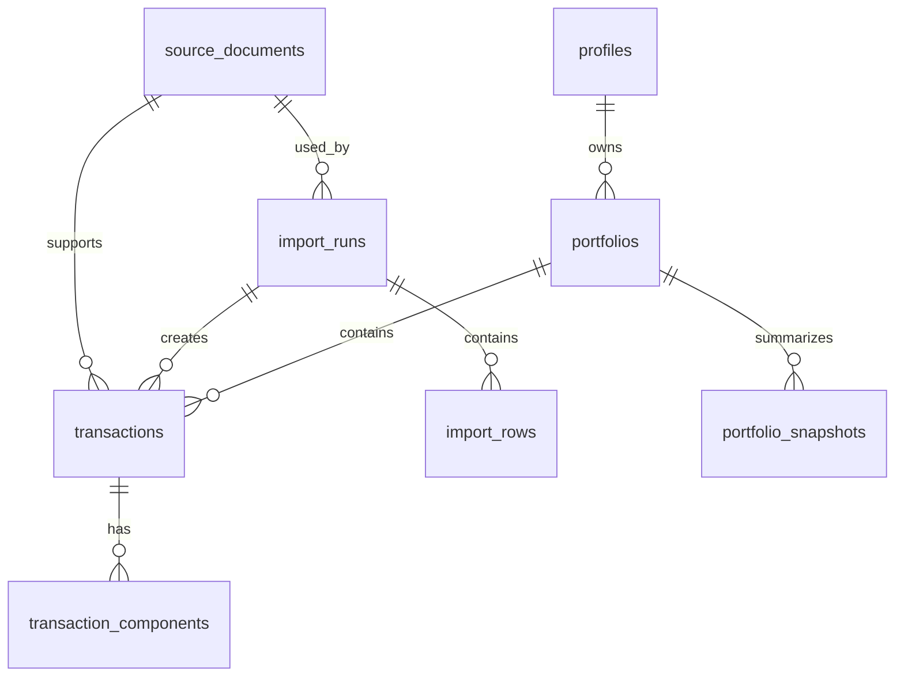

# Database Design

# Goals

The database design supports Investment Analyzer's core principle: transactions are the source of truth.

The schema should make it possible to:

- store every investment event at transaction level
- derive holdings instead of storing them as master data
- calculate lot-level performance
- calculate dividend analytics
- trace imported records back to their source
- support multiple brokers and import formats over time
- protect user data with Supabase Row Level Security

# Entity Overview

Primary MVP entities:

- `profiles`
- `portfolios`
- `transactions`
- `transaction_components`
- `market_prices`
- `market_dividends`
- `market_data_sync_runs`
- `source_documents`
- `import_runs`
- `import_rows`
- `portfolio_snapshots`

Supporting entities that may be added after MVP:

- `securities`
- `brokers`
- `broker_accounts`
- `fx_rates`
- `corporate_actions`
- `watchlist_items`
- `benchmark_prices`

# Domain Model

# Core Tables

## profiles

Stores application profile data for Supabase Auth users.

Suggested columns:

- `id uuid primary key references auth.users(id)`
- `display_name text`
- `base_currency text not null default 'EUR'`
- `created_at timestamptz not null`
- `updated_at timestamptz not null`

Notes:

- Supabase Auth remains the identity source.
- Profile rows hold product-specific user preferences.

## portfolios

Stores user portfolios. Even if MVP starts with one portfolio per user, modeling portfolios explicitly keeps the product ready for multiple broker accounts later.

Suggested columns:

- `id uuid primary key`
- `user_id uuid not null references profiles(id)`
- `name text not null`
- `base_currency text not null default 'EUR'`
- `created_at timestamptz not null`
- `updated_at timestamptz not null`

Constraints:

- unique portfolio name per user, if desired
- row ownership by `user_id`

## transactions

Stores canonical investment events. This is the central source-of-truth table.

Suggested columns:

- `id uuid primary key`
- `user_id uuid not null references profiles(id)`
- `portfolio_id uuid not null references portfolios(id)`
- `security_id uuid references securities(id)` optional and deferrable
- `security_name text not null`
- `isin text`
- `wkn text`
- `ticker text`
- `exchange text`
- `security_currency text`
- `asset_type text`
- `type text not null`
- `trade_date date not null`
- `settlement_date date`
- `quantity numeric`
- `unit_price numeric`
- `gross_amount numeric`
- `net_amount numeric`
- `currency text not null`
- `external_id text`
- `broker text`
- `source_document_id uuid references source_documents(id)`
- `import_run_id uuid references import_runs(id)`
- `notes text`
- `created_at timestamptz not null`
- `updated_at timestamptz not null`

Transaction types:

- `buy`
- `sell`
- `dividend`
- `fee`
- `tax`

Recommended sign conventions:

- quantities are positive numbers
- transaction type determines whether quantity increases or decreases holdings
- cash amounts should use an explicit convention and remain consistent across all services
- fees and taxes can be captured as components or standalone transactions depending on source data

Notes:

- In the MVP, security identity is captured directly on each transaction.
- The Securities page should be derived from transaction history rather than managed manually.
- A normalized `securities` table may still be introduced later for market-data enrichment, deduplication, and canonical metadata.

## transaction_components

Stores fee, tax, withholding tax, and other monetary components attached to a transaction.

Suggested columns:

- `id uuid primary key`
- `transaction_id uuid not null references transactions(id)`
- `component_type text not null`
- `amount numeric not null`
- `currency text not null`
- `description text`
- `created_at timestamptz not null`

Component types:

- `fee`
- `tax`
- `withholding_tax`
- `exchange_fee`
- `broker_fee`
- `other`

Notes:

- This supports auditability when a broker provides a single transaction with multiple monetary parts.
- Standalone `fee` and `tax` transactions can still exist when the source provides them separately.

## market_prices

Stores user-scoped current and historical daily market prices fetched from an external provider.

Suggested columns:

- `id uuid primary key`
- `user_id uuid not null references profiles(id)`
- `portfolio_id uuid not null references portfolios(id)`
- `security_key text not null`
- `security_name text not null`
- `isin text`
- `ticker text`
- `provider text not null`
- `provider_symbol text not null`
- `price_date date not null`
- `open_price numeric`
- `high_price numeric`
- `low_price numeric`
- `close_price numeric not null`
- `adjusted_close_price numeric`
- `volume numeric`
- `currency text not null`
- `created_at timestamptz not null`
- `updated_at timestamptz not null`

Constraints:

- unique `user_id`, `portfolio_id`, `security_key`, `provider`, and `price_date`

Notes:

- Current value is derived from latest price times current quantity.
- Historical portfolio development uses dated prices.
- Prices are persisted daily when provider limits allow it.
- Weekly, monthly, or yearly chart values should be derived from daily prices rather than fetched separately.
- For the transaction-first MVP, price lookup uses transaction-derived identifiers such as ticker and `security_key` before a canonical security table becomes necessary.

## security_provider_symbols

Stores user-scoped mappings between transaction-derived securities and provider-specific market-data symbols.

Suggested columns:

- `id uuid primary key`
- `user_id uuid not null references profiles(id)`
- `portfolio_id uuid not null references portfolios(id)`
- `security_key text not null`
- `provider text not null`
- `provider_symbol text not null`
- `source text not null`
- `notes text`
- `resolved_at timestamptz`
- `created_at timestamptz not null`
- `updated_at timestamptz not null`

Constraints:

- unique `user_id`, `portfolio_id`, `security_key`, and `provider`

Notes:

- This keeps provider-specific identifiers out of transaction facts.
- ISIN remains the preferred canonical instrument identity where available.
- Provider symbols are enrichment data and can be changed without rewriting buy, sell, or dividend records.
- Market-data sync should prefer a stored provider symbol, then fall back to deriving a symbol from transaction ticker and exchange.
- For EODHD, examples include `MUV2.XETRA`, `MSF.XETRA`, and `AAPL.US`.

## market_dividends

Stores user-scoped reference dividend events fetched from an external market data provider.

Suggested columns:

- `id uuid primary key`
- `user_id uuid not null references profiles(id)`
- `portfolio_id uuid not null references portfolios(id)`
- `security_key text not null`
- `security_name text not null`
- `isin text`
- `ticker text`
- `provider text not null`
- `provider_symbol text not null`
- `ex_dividend_date date not null`
- `declaration_date date`
- `record_date date`
- `payment_date date`
- `amount_per_share numeric not null`
- `currency text not null`
- `created_at timestamptz not null`
- `updated_at timestamptz not null`

Constraints:

- unique `user_id`, `portfolio_id`, `security_key`, `provider`, `ex_dividend_date`, and `amount_per_share`

Notes:

- These are market/reference dividends, not necessarily the user's actual received cash.
- Actual received dividends remain `transactions` with type `dividend`, because broker data includes taxes, withholding tax, FX, and payment timing.
- Reference dividends can later support reconciliation and expected-dividend analytics.

## market_data_sync_runs

Tracks market data fetch attempts.

Suggested columns:

- `id uuid primary key`
- `user_id uuid not null references profiles(id)`
- `portfolio_id uuid not null references portfolios(id)`
- `security_key text`
- `provider text not null`
- `provider_symbol text`
- `status text not null`
- `prices_imported integer not null`
- `dividends_imported integer not null`
- `error_message text`
- `started_at timestamptz not null`
- `finished_at timestamptz`
- `created_at timestamptz not null`

Notes:

- Sync runs make provider failures and rate-limit issues visible.
- The MVP syncs per security first to avoid accidentally exceeding provider limits.

## source_documents

Stores metadata for imported files, broker documents, and other source artifacts.

Suggested columns:

- `id uuid primary key`
- `user_id uuid not null references profiles(id)`
- `portfolio_id uuid references portfolios(id)`
- `document_type text not null`
- `source_type text not null`
- `storage_path text`
- `original_filename text`
- `content_hash text`
- `broker text`
- `uploaded_at timestamptz not null`
- `created_at timestamptz not null`

Document types:

- `csv`
- `broker_statement`
- `postbox_document`
- `manual_entry`
- `api_payload`

Source types:

- `manual`
- `csv`
- `comdirect`
- `trade_republic`
- `interactive_brokers`

## import_runs

Tracks every import attempt.

Suggested columns:

- `id uuid primary key`
- `user_id uuid not null references profiles(id)`
- `portfolio_id uuid not null references portfolios(id)`
- `source_document_id uuid references source_documents(id)`
- `source_type text not null`
- `broker text`
- `status text not null`
- `started_at timestamptz not null`
- `finished_at timestamptz`
- `rows_total integer`
- `rows_imported integer`
- `rows_failed integer`
- `error_message text`
- `created_at timestamptz not null`

Statuses:

- `pending`
- `processing`
- `completed`
- `completed_with_errors`
- `failed`

## import_rows

Preserves row-level import traceability.

Suggested columns:

- `id uuid primary key`
- `import_run_id uuid not null references import_runs(id)`
- `row_number integer`
- `raw_payload jsonb not null`
- `normalized_payload jsonb`
- `status text not null`
- `transaction_id uuid references transactions(id)`
- `error_message text`
- `created_at timestamptz not null`

Notes:

- This table is especially useful for CSV and broker statement imports.
- It supports reproducible import debugging without polluting canonical transactions.

## portfolio_snapshots

Stores derived portfolio development points for performance and charting. These are cache-like records, not source-of-truth holdings.

Suggested columns:

- `id uuid primary key`
- `user_id uuid not null references profiles(id)`
- `portfolio_id uuid not null references portfolios(id)`
- `snapshot_date date not null`
- `invested_capital numeric not null`
- `portfolio_value numeric not null`
- `capital_gain numeric not null`
- `dividend_income numeric not null`
- `currency text not null`
- `calculation_version text`
- `created_at timestamptz not null`

Constraints:

- unique `portfolio_id`, `snapshot_date`, and `calculation_version`

Notes:

- Snapshots can be regenerated from transactions and prices.
- They should not be edited manually.

# Derived Models

These should be represented in services or database views rather than stored as master data.

## Holding

Derived from transactions.

Fields:

- `portfolio_id`
- `security_name`
- `isin`
- `ticker`
- `quantity`
- `cost_basis`
- `average_cost`
- `latest_price`
- `current_value`
- `unrealized_gain`
- `unrealized_gain_percent`

## Purchase Lot

Derived primarily from buy transactions and adjusted by sell transactions.

Fields:

- `buy_transaction_id`
- `security_name`
- `isin`
- `ticker`
- `buy_date`
- `original_quantity`
- `remaining_quantity`
- `unit_price`
- `cost_basis`
- `current_value`
- `unrealized_gain`
- `unrealized_gain_percent`
- `annualized_return`
- `total_dividends_received`
- `yield_on_cost`
- `current_dividend_profitability`
- `average_dividend_profitability`

## Dividend Allocation

Derived by associating dividend transactions with eligible held lots.

Fields:

- `dividend_transaction_id`
- `buy_transaction_id`
- `security_id`
- `ex_date` or `payment_date`
- `allocated_amount`
- `currency`

The MVP can start by allocating dividends proportionally to held quantity on the dividend date. The exact allocation rule must be documented because dividend analytics depend on it.

The current implemented formulas are documented in `docs/analytics-rules.md`.

MVP dividend profitability definitions:

- Current dividend profitability is trailing-12-month allocated dividend per currently open share divided by the buy-lot price.
- Average dividend profitability is lifetime allocated dividends divided by years held, divided by original lot quantity, divided by the buy-lot price.
- Buy-lot price is derived as lot cost basis divided by original quantity.
- These are yield-on-cost style metrics, not current market dividend yield.

# Row Level Security

Tables with user-owned data should include `user_id` and enforce RLS policies:

- `profiles`
- `portfolios`
- `transactions`
- `source_documents`
- `import_runs`
- `import_rows`
- `portfolio_snapshots`

Shared or reference-like tables:

- `market_prices`

Security principles:

- users can only access their own financial records
- securities derived from user transactions can only be seen by that user
- source documents must be scoped by user
- import rows should inherit access through `import_runs`
- writes should validate portfolio ownership

# Indexing Strategy

Recommended indexes:

- `transactions(user_id, portfolio_id, trade_date)`
- `transactions(user_id, isin)`
- `transactions(user_id, ticker)`
- `transactions(portfolio_id, security_id, trade_date)`
- `transactions(import_run_id)`
- `transactions(source_document_id)`
- `market_prices(user_id, portfolio_id, security_key, price_date desc)`
- `market_dividends(user_id, portfolio_id, security_key, ex_dividend_date desc)`
- `market_data_sync_runs(user_id, created_at desc)`
- `import_runs(user_id, portfolio_id, started_at desc)`
- `import_rows(import_run_id, row_number)`
- `portfolio_snapshots(portfolio_id, snapshot_date)`
- `source_documents(user_id, uploaded_at desc)`

# Idempotency And Duplicate Detection

Imports should avoid duplicate transactions.

Useful duplicate keys:

- broker external transaction ID
- source document hash plus row number
- normalized transaction fingerprint

Example fingerprint inputs:

- portfolio
- security
- type
- trade date
- quantity
- unit price
- net amount
- currency
- broker

The system should store enough import metadata to explain why a row was imported, skipped, or rejected.

# MVP Schema Scope

Required for MVP:

- `profiles`
- `portfolios`
- `transactions`
- `transaction_components`
- `market_prices`
- `market_dividends`
- `source_documents`
- `import_runs`
- `import_rows`

Optional but recommended for MVP charts:

- `portfolio_snapshots`

Deferrable until after MVP:

- `securities`
- `broker_accounts`
- `fx_rates`
- `corporate_actions`
- `benchmark_prices`

# Open Database Questions

- Should the MVP support multiple currencies, or assume EUR while keeping currency columns ready?
- Should dividend transactions reference `security_id` only, or also a broker cash account later?
- Should taxes and fees be modeled as components first, standalone transactions first, or both?
- Should market prices be user-imported initially or fetched from a provider?
- Should snapshots be calculated on demand first and persisted only when performance requires it?
